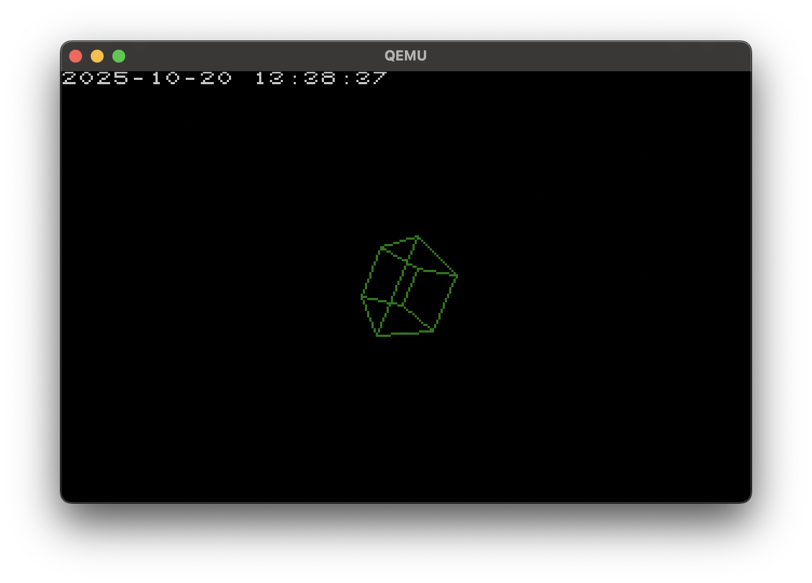

# mboot
mboot is a minimal os for i386 platforms.

## Prequisites
Building mboot depends on:
 - llvm tools (clang, ld.lld)
 - nasm

Running mboot needs:
 - the building tools or a disk image
 - qemu-system-x86_64

## Building
Note: inside the makefile there is a line appending a macro definition to `CFLAGS`. Edit the macro's value to bundle different demos to run on boot
```sh
make
# normal os
qemu-system-x86_64 -m 4G -drive file=image.img -serial stdio

# with networking enabled
qemu-system-x86_64 -m 4G -drive file=image.img -serial stdio -device e1000,netdev=n0 -netdev user,id=n0 -object filter-dump,id=f1,netdev=n0,file=netdump.pcap

# with networking enabled and UDP forwarded from host port 10007 to guest port 7
qemu-system-x86_64 -m 4G -drive file=image.img -serial stdio \
  -device e1000,netdev=n0 \
  -netdev user,id=n0,hostfwd=udp::10007-:7 \
  -object filter-dump,id=f1,netdev=n0,file=netdump.pcap
```

## UDP demo
The kernel now starts a UDP echo service on guest IP `10.0.2.15`, port `7`.

Run QEMU with host UDP forwarding:
```sh
qemu-system-x86_64 -m 4G -drive file=image.img -serial stdio \
  -device e1000,netdev=n0 \
  -netdev user,id=n0,hostfwd=udp::10007-:7 \
  -object filter-dump,id=f1,netdev=n0,file=netdump.pcap
```

From the host, send a datagram to the forwarded port:
```sh
printf 'hello from host\n' | nc -u -w 1 127.0.0.1 10007
```

If your `nc` supports listen mode, you can also watch the echoed reply with a second terminal:
```sh
nc -u -l 10007
```

On the guest serial log you should see:
- the local IPv4 address announcement
- `UDP echo service listening on port 7`
- an `RX a.b.c.d:src -> 10.0.2.15:7` log line
- an `Echoing N bytes back to port src` log line

## Demo options
Demo options include:
- `CUBE_DEMO`
- `TIME_DEMO`
- `E1K_DEMO`
- `IMF_DEMO`
- `PSF_DEMO`

## Note
As filesystems and elf files aren't implemented yet, programs you want to launch from mboot need to be linked into it and called from `loader.c`

## todo:
- [x] 32 bit protected mode
- [x] cpu exceptions
- [x] individual hardware interrupts
- [x] a ps/2 keyboard
- [x] vga in 320x200x8bpp
- [x] reading ata drives
- [x] rs232 interfaces
- [x] the intel 8259 PIC
- [x] the intel 8253 PIT
- [x] the mbr partitioning scheme
- [x] wad files as the filesystem
- [x] enable x87 fpu
- [ ] memory allocator
- [ ] elf loader
- [ ] paging
- [ ] libc

## Screenshots

